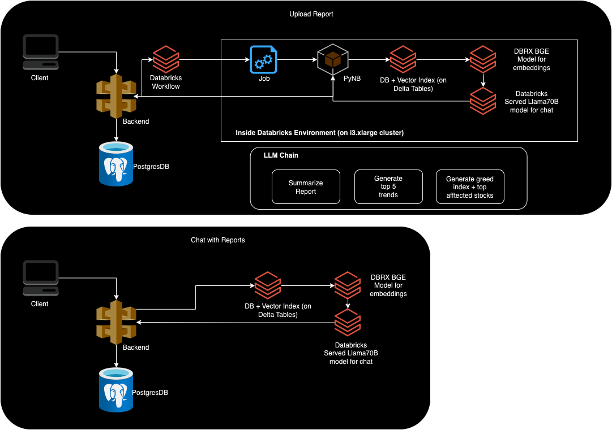

## OnlyTrends

OnlyTrends is a one-stop platform to find publicly available reports, find AI-curated trends from them, and a friendly AI chatbot that helps you parse through the noise and find actionable insights and investment ideas. You can dig into trends from specific reports or dive headfirst into the entire knowledge pool!

# Architecture

# Steps

Databricks
- Create enterprise account
- Add AWS account
- Create PAT Token
- Create a Databricks secret to save the PAT Token
- Create a cluster
- Attach Github to repos inside Workspace to the `/databricks-nb` folder
- Create a workflow and attach the above notebook to create a job

Backend
- Run `python3 -m venv env` and `source ./env/bin/activate`
- Run `pip install -r requirements.txt`
- Create a copy of `.env.sample` file named `.env` and fill the required values
- Run `flask run`

Frontend
- Run `npm install`
- Create a copy of `.env.sample` file named `.env` and fill the required values
- Run `npm run dev`